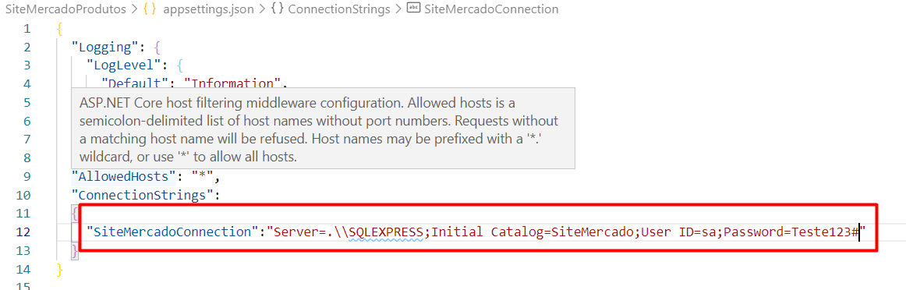
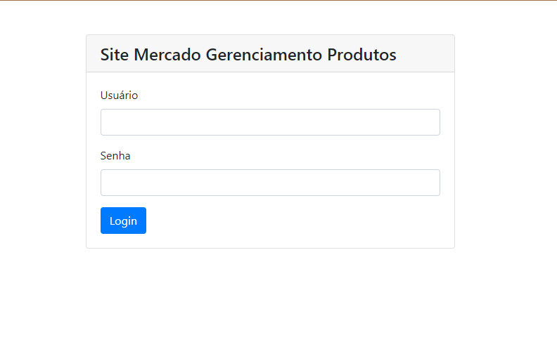
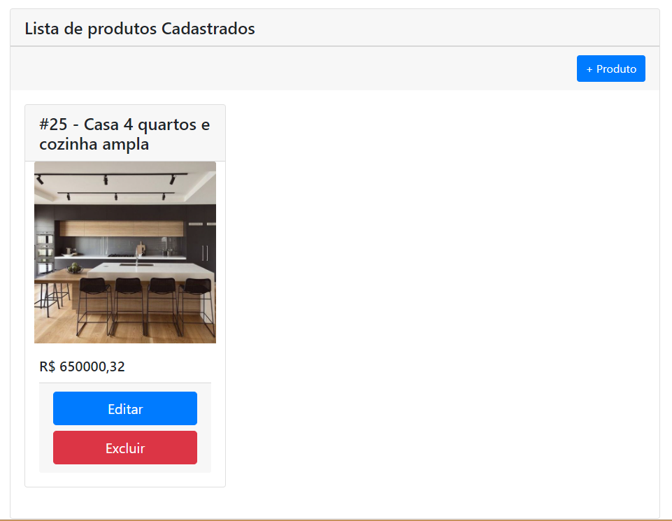
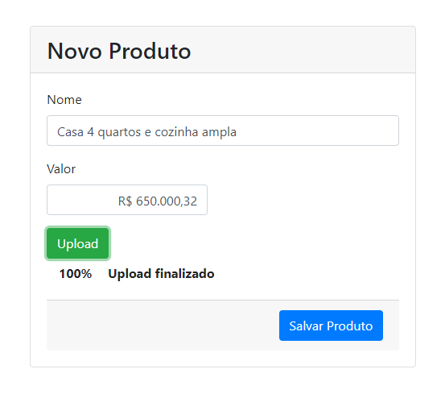

# Site Cadastro de Produtos

O projeto consiste na criação de um site com tela de login que acessa a api do SiteMercado

E faz o CRUD de produtos utilizando:

- Sql Server 2014 ou superior
- .net core;
- EntityFramework core;
- Html, Css e javascript;
- Angular 8+;

Primeiramente o script está disponível e atende pelo seguinte endereço:

### [scripts.sql](scripts.sql)
 

# Configurações
## AppSettings.json
É necessário editar as configurações de acesso a base de dados no arquivo appsettings.json

  
## Sql Server
Você deve criar uma instância do banco de dados e substituir pelo **Initial Catalog**
  

O sistema foi construido utilizando o entityframework core, logo, você poderá atualizar o banco de dados sem nenhum script apenas executando o seguinte comando no terminal no mesmo diretório da aplicação .NET
  
**local: /SiteMercadoProdutos**

Commando utilizando CLI:
> dotnet ef database update

## Comandos CLI

O sistema foi desenvolvido em .net core, logo as configurações são para execução via CLI, assim o endereço correspondente a API fica com:

> https://localhost:5001

Esse endereço foi configurado nas variáveis de ambientes e fixos no Angular.

## Atualização pacotes e Start

Necessário executar o comando:
> npm install 

e em seguida executar os seguintes dois comandos

> dotnet build

> dotnet run

Assim você dá start na web api.
  
# Angular
## Configuracao
Todas as configurações em angular estão vinculadas a webapi, logo, nenhuma configuração relacionada a endereçamento é necessária.

## Inicialização
Para iniciar o projeto você deve ter o node.js instalado na máquina e em seguida executar o seguinte comando:

Lembrando do local deve ser aberto é o:

**local: /Angular**

> npm i

Logo em seguida:

> ng serve -o

Ele abrirá o browser para que você faça o acesso ao sistema.
  
# Navegação

Primeira tela é a tela de login que faz acesso a api do site mercado, Todo o site necessita de autorização via AuthGuard que é adicionado as rotas:

## Tela Listagem
A tela em que é feita a listagem de produtos e remoção de itens é a home:

## Tela Cadastro
Tela em que é feito a atualização de itens e cadastro de novos itens

Todo o código segue no github para poder ser baixado.

Att
Paulo Bob

